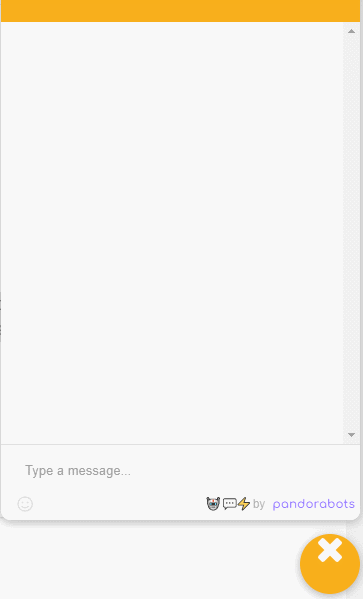

# Chat Bot
A human-response simulated application that gives career advice to computer science students.

    

---
## Table of contents
- [Purpose](#purpose)
- [Method](#method)
- [Installation](#installation)
- [Navigation](#navigation)
- [Reflection](#reflection)
- [Links](#links)

---
## Purpose
Simulates a discussion in natural language to display the use for artificial intelligence. It reduces or removes the need for addressing repetitive tasks via human intervention.

---
## Method
I modeled a scene that represents the aftermath of a flood, with models to represent huamn bodies, water puddles and scattered debris. I modified the bubbleRob robot to add an infrared laser which is used to detect the heat, a sensor laser to detect water, and an ultrasonic sensor to detect the building debris. The robot gathers knowledge from the sensors to decide its recovery path, and then uses the results of the sensors to decide which set of instructions to follow. By default, it will follow an uncertain path until something changes, then it will use reasoning to decide what to do next.

---
## Installation
1. Download chat-bot.zip folder and unzip
2. Open [PandoraBots](https://home.pandorabots.com/)
3. Click on "Sign In" (top left)
4. Create a new bot by clicking the + next to MY BOTS
5. Fill in the fields -- Name: (any), Language: English, Content: Blank Bot
6. Edit (dropdown) Code editor > AIML > UDC
7. File > Upload > Select Files
8. Upload the unzipped file (udc.aiml)

---
## Navigation
1. Click the yellow icon in the corner to open the bot
2. Start the bot by typing start and follow the prompts

---
## Reflection
To improve the chatbot’s performance, I'd add a more in-depth analysis with more questions and career options.
I would also add the ability to schedule an appointment from available times with a guidance counselor.

---
## Links
[PandoraBots](https://developer.pandorabots.com/home.html)
